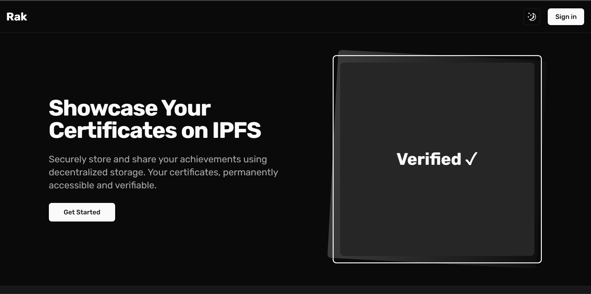

# Rak - Decentralized Certificate Verification Platform

<div align="center">
  
  <p><em>Secure your achievements on the decentralized web</em></p>
</div>

## Introduction

Rak is a modern platform that leverages the InterPlanetary File System (IPFS) to provide secure, permanent, and tamper-proof storage for your certificates and achievements. In an era where digital credentials are increasingly important, Rak ensures your accomplishments are verifiable and accessible forever.

Unlike traditional certificate storage solutions that rely on centralized servers, Rak stores your certificates on a distributed network, making them resistant to censorship, server failures, and data loss. Each certificate receives a unique Content Identifier (CID) that serves as cryptographic proof of the document's authenticity.

## Table of Contents

- [Features](#features)
- [Tech Stack](#tech-stack)
- [Getting Started](#getting-started)
  - [Prerequisites](#prerequisites)
  - [Installation](#installation)
- [Usage](#usage)
- [Architecture](#architecture)
- [Contributing](#contributing)
- [License](#license)

## Features

- **Decentralized Storage**: All certificates are stored on IPFS, ensuring they remain accessible indefinitely
- **Easy Verification**: Share a simple link that anyone can use to verify the authenticity of your credentials
- **User-Friendly Interface**: Modern, responsive design that works across all devices
- **Dark/Light Mode**: Choose the visual theme that works best for you
- **Secure Authentication**: Login with popular providers like Google and GitHub
- **Privacy Controls**: You decide who can see your certificates and how they're shared

## Tech Stack

- **Frontend**: Next.js, React, Tailwind CSS, Shadcn UI
- **Backend**: Next.js API Routes
- **Authentication**: NextAuth.js
- **Database**: Prisma with MongoDB
- **Storage**: IPFS via Filebase
- **Deployment**: Vercel

## Getting Started

### Prerequisites

Before you begin, ensure you have the following prerequisites:

- [Node.js](https://nodejs.org/) (version 18.x or higher)
- [Bun](https://bun.sh/) (recommended) or npm/yarn
- [MongoDB](https://mongodb.com/) (local instance or cloud-based)

### Installation

1. Clone the repository:

   ```bash
   git clone https://github.com/your-username/rak.git
   cd rak
   ```

2. Install dependencies:

   ```bash
   bun install
   # or
   npm install
   ```

3. Create a `.env` file in the root directory with the following environment variables:

   ```env
   DATABASE_URL="mongodb://localhost:27017/rak"

   AUTH_GOOGLE_SECRET="google-secret-key"
   AUTH_GOOGLE_ID="google-id"

   AUTH_GITHUB_SECRET="github-secret-key"
   AUTH_GITHUB_ID="github-id"

   AUTH_URL="http://localhost:3000/api/auth"
   AUTH_SECRET="secret-key"

   NEXT_PUBLIC_URL="http://localhost:3000"
   NEXT_PUBLIC_IPFS_KEY="ipfs-key"

   NEXT_PUBLIC_FLAGSMITH_ENV="flagsmith-environment-id"
   ```

4. Generate Prisma client:

   ```bash
   bunx prisma generate
   ```

5. Start the development server:

   ```bash
   bun dev
   # or
   npm run dev
   ```

6. Open your browser and navigate to [http://localhost:3000](http://localhost:3000)

## Usage

1. **Sign up/Login**: Create an account using Google or GitHub authentication
2. **Upload Certificate**: Click the "Create" button to upload a new certificate
3. **View Certificates**: Browse your uploaded certificates from the dashboard
4. **Share**: Click on a certificate to view its details and share it with others
5. **Verify**: Anyone with the link can verify the authenticity of your certificate without needing an account

## Architecture

Rak follows a modern web application architecture:

- **App Router**: Utilizes Next.js App Router for server components and efficient routing
- **Server Components**: Leverages React Server Components for improved performance
- **API Routes**: RESTful API endpoints for data operations
- **Authentication Flow**: Secure OAuth-based authentication with session management
- **IPFS Integration**: Uploads files to IPFS via Filebase for permanent, decentralized storage

## Contributing

We welcome contributions from the community! To contribute:

1. Fork the repository
2. Create a new branch (`git checkout -b feature/amazing-feature`)
3. Make your changes
4. Commit your changes (`git commit -m 'Add some amazing feature'`)
5. Push to the branch (`git push origin feature/amazing-feature`)
6. Open a Pull Request

Please read our [Contributing Guidelines](CONTRIBUTING.md) for more details.

## License

This project is licensed under the [MIT License](LICENSE).

---

<div align="center">
  <p>Built with ❤️ for the decentralized web</p>
</div>
